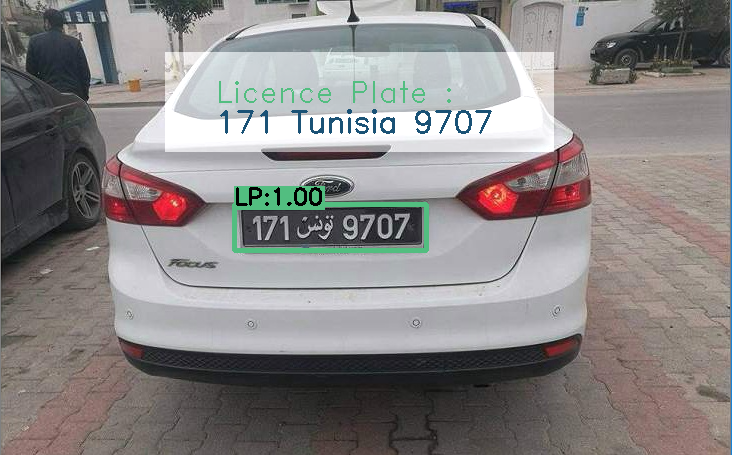

# Vehicle-Recognition-System-in-Tunisia


This project is about developping a vehicle recognition system in Tunisia. It demonstrates the outcome of the summer internship (2 months) for second year students of the National School for Computer Sciences.

**Problem setting :**

The number of vehicles in the world is increasing rapidly every year, particularly in Tunisia. Therefore, several difficulties will be found to discover the vehicles identities when there is some problems such as parking violation enforcement, highway toll payment and also finding stolen cars. Added to that, it is impossible sometimes to identify the vehicle’s owner who escaped from authorities after causing an accident. This fact leads to develop an autonomous licence plate recognition system to identify vehicles and facilitate traffic management which is a popular and active research topic in the field of computer vision, image processing and intelligent transport systems.


**Main Goals :** 

This project aims to solve the problem of vehicle identification in Tunisia using Deep Learning models. To do that, our mission is to find a solution based on DL models and image processing to accomplish the following tasks :
- Detecting the presence of the vehicle’s licence plate.
- Image segmentation and extraction of the text written on the licence plate.
- Text classification with deep learning.
- Development of a desktop application (UI) using .Net

📍 **Keywords :** Python, Computer Vision, Deep Learning, Image segmentaton, Yolo, Faster-RCNN, Tensorflow, Keras, OpenCV, c# (.Net)  

📓 **Paper** : <a href="./Documentation/Report - Hawk Eye Tunisia - Vehicle Recognition System.pdf"> Report.pdf</a> or <a href="https://drive.google.com/file/d/1eu5EJU74HGsw568w4aWfh3WxRSMfUvvq/view?usp=sharing">Link</a>.
<hr>
<h3>:round_pushpin: Requirements</h3>

```shell
!pip install -r Deep-Learning/requirements.txt
```
<h3>📍 Main scripts</h3> 

In the AI part of this project, we have : 

1- Vehicle license plate detection using Yolo :
The licence plate detection folder contains these necessary files : **lapi.weights , darknet-yolov3.cfg , classes.names**
which will be called by for the ```object_detection_yolo.py``` script.

**🔗 Attachments :**
Here additional files (lapi.weights, model.weights,darknet) that should be dowloaded and added to ```Deep-Learning\Licence_plate_detection``` : <a href="https://www.dropbox.com/s/fxyblp7dezmy2jp/Attachments.zip?dl=0">Dropbox Link</a>


2- Text segmentation

3- Character classification using deep learning model based on CNN architecture : 

After training our CNN model, the ```Deep-Learning/Main-Scripts/Hawk_Eye_LP_recognition.py``` script needs to import our saved model ```ocrmodel.h5```.

- The final script ```Deep-Learning/Main-Scripts/main_vehicle_to_LP.py``` use the previous scripts for the detection and classification of the tunisian LP.

We can run the main script with this command :

```shell
!python main_vehicle_to_LP.py --image=path
```
Where :
- **The input :** vehicle image
- **The output :** path of the final image containing the result of the LP detection (green box) and a text showing the result of the LP recognition.


<h3>Note</h3>
In the folder **Deep-Learning/Notebooks**, there are 5 jupyter notebooks that are explaining with description and results the different steps of our work.

<hr>
<h3>Screenshots :</h3>

📝 The project process 


📝 The license plate segmentation 


📝 The .Net app : 

**In this repo, we are not sharing the entire code of our application.**


📝 License Plate detection : 


📝 License Plate recognition : 



📝 Real time License Plate recognition through camera : 


<hr>
<h3>Next step :</h3>

To improve the result : 
- The character segmentation method can be improved to split affected licence plates (bad aspect) or image taken from different angles.
- We trained our classification model with 600 images of characters (digits from 0 to 9 and the word of "tunis").
To improve the model performance, we can add more samples. To do that, we should prepare new cropped characters manually (28x28 pixels) and practise some data augmentation techniques.
<hr>

📅 **Last Update On** : September 2020.


✉️ **Contact :**

email : ghassene.tanabene@gmail.com

linkedin : https://www.linkedin.com/in/ghassene-tanabene/
